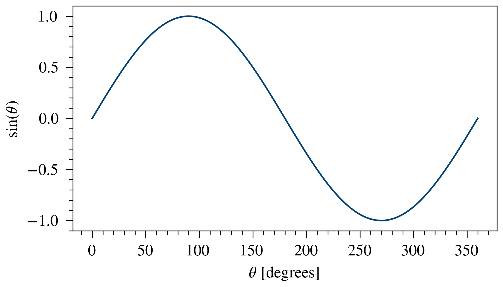

# `funkyfresh`: Science Journal Graphics Styles for Matplotlib

This package provides functions which automatically set Matplotlib style 
parameters (fonts, line weights, etc.) to match those of select scientific 
journals. If you use this, your plots will look funky and fresh (at least 
compared to the Matplotlib defaults).

## Currently-Supported Styles
- American Geophysical Union (AGU)
  - Journal of Geophyiscal Research (JGR)
  - Geophysical Research Letters (GRL)
- American Astronomical Society (AAS)
  - Astrophysical Journal Letters (ApJL)
  - Astronomical Journal (AJ)
  - Astrophysical Journal (ApJ)
  - Planetary Science Journal (PSJ)
- My personal styles:
  - LaTeX article class with 10-point STIX2 fonts
  - Caltech Thesis format with 12-point STIX2 fonts and color dictionaries from
    the Caltech Identity Toolkit (https://identity.caltech.edu).

## Installation
Here are some installation instructions for the average Anaconda user, if 
you're more advanced I'm sure you can figure it out from here. (Note: in the
instructions below I will assume that you are using a virtual environment named 
`myenv`.) I've tested this using Python 3.10.
1. Activate your virtual environment:<br>
    `% conda activate myenv`
2. Install the `funkyfresh` package and its dependencies:<br>
    `% python -m pip install git+https://github.com/zachariahmilby/science-journal-graphics-styles.git`

You're now ready to use the `funkyfresh` package!

> **NOTE**<br>
> If you're using Jupyter on a Mac, including <br>
> `%config InlineBackend.figure_format = 'retina'` after you import `pyplot` 
> will make any of your inline graphics displayed with `plt.show()` higher 
> resolution.

## Usage
Usage is pretty simple. Start by importing the function for the desired style.
These are the current styles available:
1. `set_aas_style`
2. `set_agu_style`
3. `set_personal_whitepaper_style()`
4. `set_caltech_thesis_style()`

For example, to set the style to match a JGR journal:
```
from funkyfresh import set_agu_style
style = set_agu_style()
```
The function returns an object which has a few parameters you might want to 
use when making figures. The documentation for each style lists the available
properties you can access.

## Example
Let's say for some reason I want a plot of one period of a sine wave for a 
paper I'm going to publish in the AGU journal Geophysical Research Letters. 
Here's a sine curve plotted with the default settings. It looks alright, but 
the fonts don't match the journal style at all, so this plot will look 
inconsistent with the rest of the document.
```
import astropy.units as u
import matplotlib.pyplot as plt
import numpy as np

theta = np.linspace(0, 360, 3601) * u.degree

fig, axis = plt.subplots(constrained_layout=True)
axis.plot(theta, np.sin(theta))
axis.set_xlabel(r'$\theta$ [degrees]')
axis.set_ylabel(r'$\sin(\theta)$')
plt.show()
```


By calling `set_agu_style()` and changing the figure width to 
`column_width` and the color of the line to the blue color included in the 
style, the same plot looks much better with minimal changes to the code. The
fonts now match the journal figure captions both in typeface and size, the
lineweights also match, and the figure size should (hopefully) encourage 
whoever is typesetting your paper to place this image in a column-width figure.
I'd probably still make a few changes (like placing major ticks along the 
horizontal axis to multiples of 60, and minor ticks to multiples of 15), but 
those types of changes aren't a matter of visual style but rather best 
practices for data display.
```
import astropy.units as u
import matplotlib.pyplot as plt
import numpy as np
from funkyfresh import set_agu_style

style = set_agu_style()

theta = np.linspace(0, 360, 3601) * u.degree

fig, axis = plt.subplots(figsize=(style.column_width, 2), constrained_layout=True)
axis.plot(theta, np.sin(theta), color=style.blue)
axis.set_xlabel(r'$\theta$ [degrees]')
axis.set_ylabel(r'$\sin(\theta)$')
plt.show()
```

